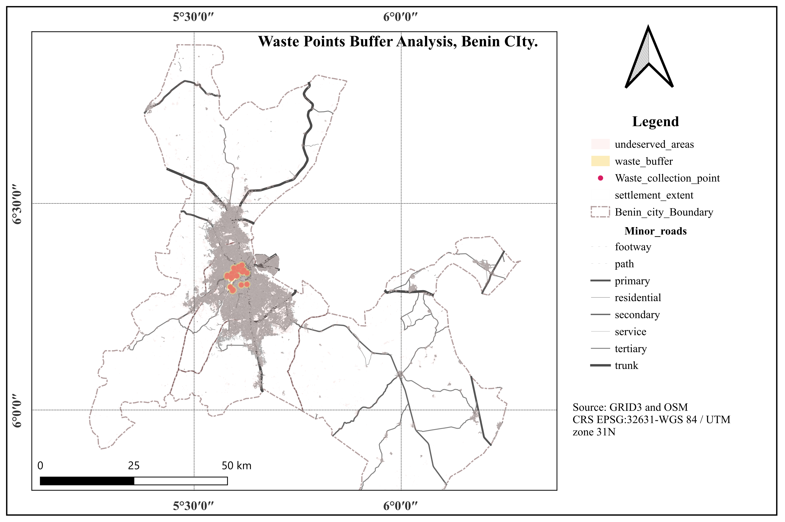

# WEEK 4  

## Check CRS; 

Confirmed that all active data on the layer panel are reprojected to the right coordinate referencing system (CRS EPSG:32631-WGS 84 / UTM zone 31N).

## What to expect;

The operation chosen for this project at the current stage is buffer analysis, and that is because my research question is fundamentally about distance. With about 27,000 blobs of settlement and only a few waste collection points concentrated at the city center a buffer analysis of 1km (1000m) will cover at best 20%, another 20% partially covered and the larger percentage to be uncovered.

## How to run it;

**Analysis type**: Buffer Analysis

a. Confirm both layers are in the same projected CRS Right-click both layers (waste collection points and settlement extents) → Properties → Information → check CRS. Both need to be in a projected meters-based CRS — EPSG:32631 (UTM 31N) for Benin City. Vector → Data Management Tools → Reproject Layer.

b. Add a unique ID field to the settlement layer on the settlement extent layer, open Field Calculator (abacus icon) → tick 'Create new field' → name it settlement_id → type Whole number → expression: $id. Click OK. This gives every settlement polygon a unique number, since settlement extents are often unnamed or share duplicate names.

c. Calculate total area per settlement, before anything else Same settlement layer, Field Calculator again → new field total_km2 → Decimal number → expression: $area / 1000000. Click OK. Do this now, before buffering or differencing, so the value travels with each settlement through the rest of the workflow.

d. Buffer the waste collection points vector → Geoprocessing Tools → Buffer. Input layer: your waste collection points. Distance: your chosen threshold in meters (1000m, or 1km catchment). Tick 'Dissolve result' so overlapping buffers merge into one shape. Save as waste_buffer. gpkg. Click Run.

## Run Difference: 

settlements minus the buffer vector → Geoprocessing Tools → Difference. Input layer: your settlement extent layer (with settlement_id and total_km2 already added). Overlay layer: waste_buffer. gpkg. Save as underserved_settlements. gpkg. Click Run. This output keeps settlement_id and total_km2 automatically — settlements fully inside the buffer simply won't appear in the output at all.

## The uncovered area in km2

 Add the uncovered-area column open underserved_settlements. gpkg attribute table → Field Calculator → new field uncovered_km2 → Decimal number → expression: $area / 1000000. Click OK.

## Join layers

 Join underserved_settlements back to the original settlement layer using settlement_id Right-click your original settlement layer (from step a/b, before differencing) → Properties → Joins tab → click +. Join layer: underserved_settlements. Join field: settlement_id. Target field: settlement_id. Click OK, then OK again. This matches on the unique number, not a name, so it's reliable.

## Pct Uncovered

 Calculate the final percentage, handling nulls in the formula on the joined settlement layer, Field Calculator → new field pct_uncovered → Decimal number → expression: CASE WHEN "uncovered_km2" IS NULL THEN 0 ELSE "uncovered_km2" / "total_km2" * 100 END. Click OK. This scores fully-covered settlements (which dropped out of the Difference output) as 0% automatically, instead of leaving a blank.

 ## Statistics

  
|SN | Statistic | Value |
|---|---|---|
|1 |Count | 26769 | 
|2 |Sum |	2.48725e+06 |
|3 |Mean |	92.9153 |
|4 |Median |	100 |
|5 |St dev  (pop) |	25.2886 |
|6 | St dev (sample) |	25.2891 |
|7| Minimum | 0 |
|8| Maximum | 100 |
 9 |Range	| 100 |
|10| Minority	| 0.00121898 |
|11| Majority |	100 |
|12| Variety |	348 |
|13| Q1 |	100 |
|14| Q3 |	100 |
|15| IQR |	0 |
|16| Missing (null) values |	0 |

**Status complete**: [Month-1-summary](Month-1.md) 
